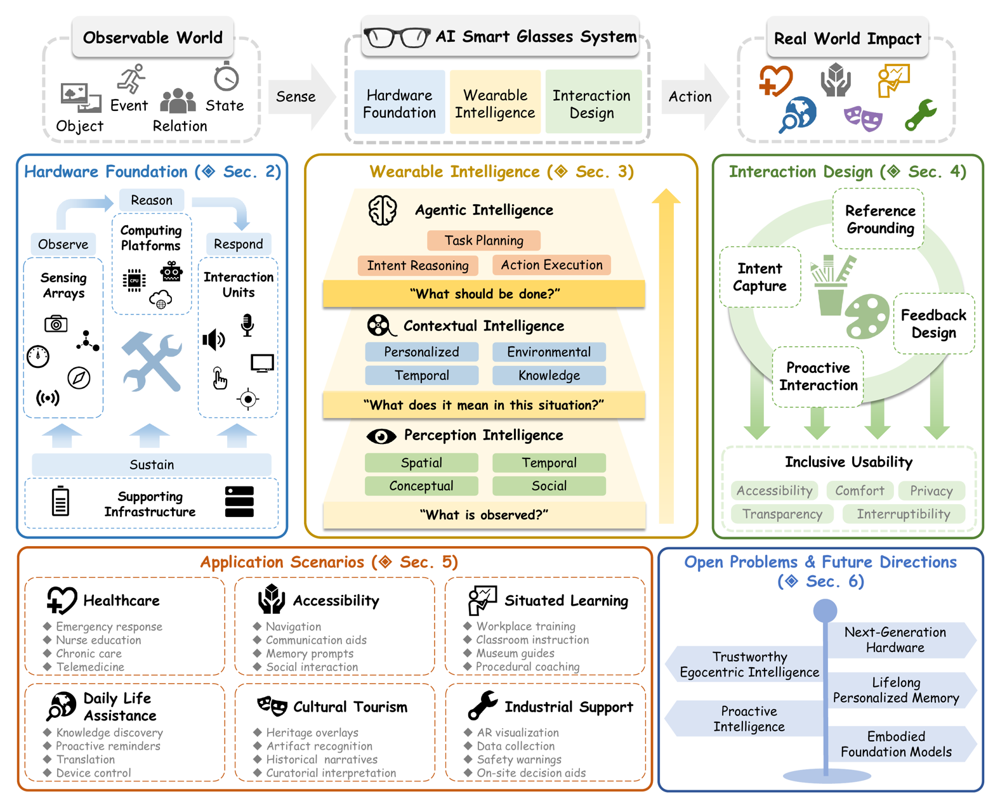
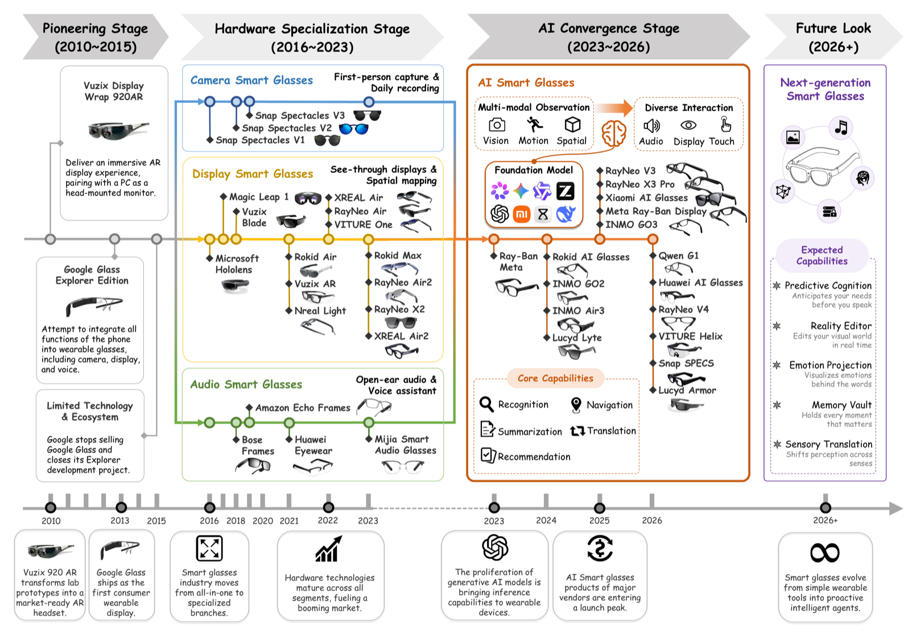
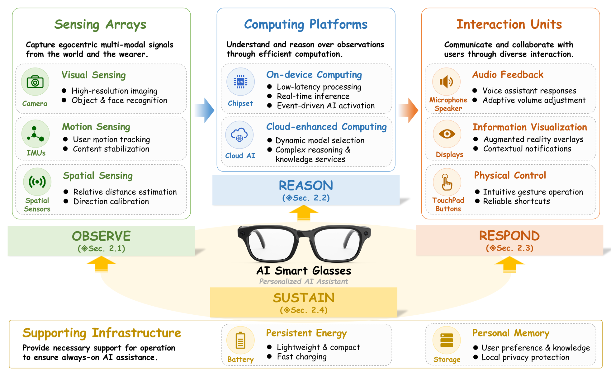
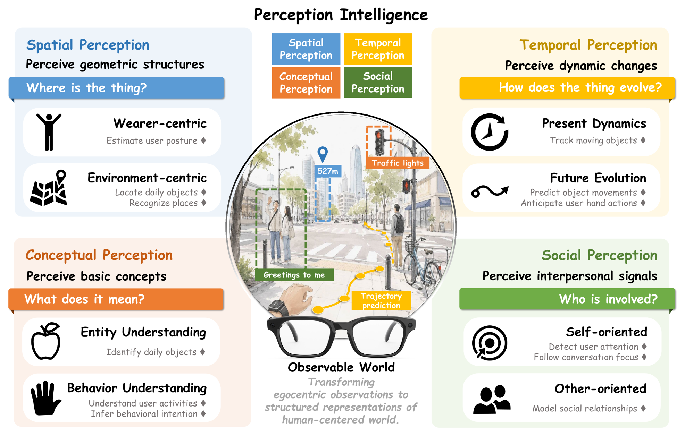
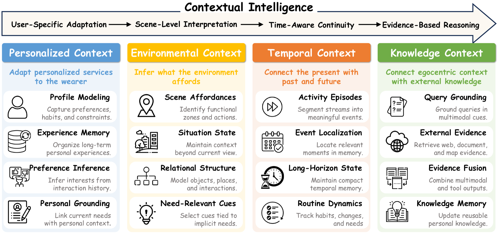
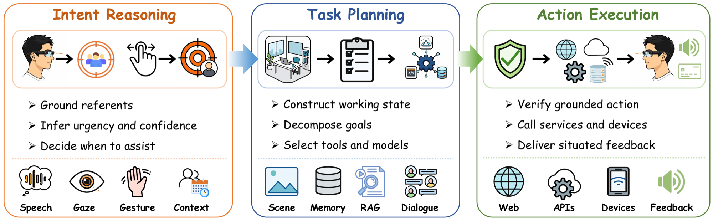
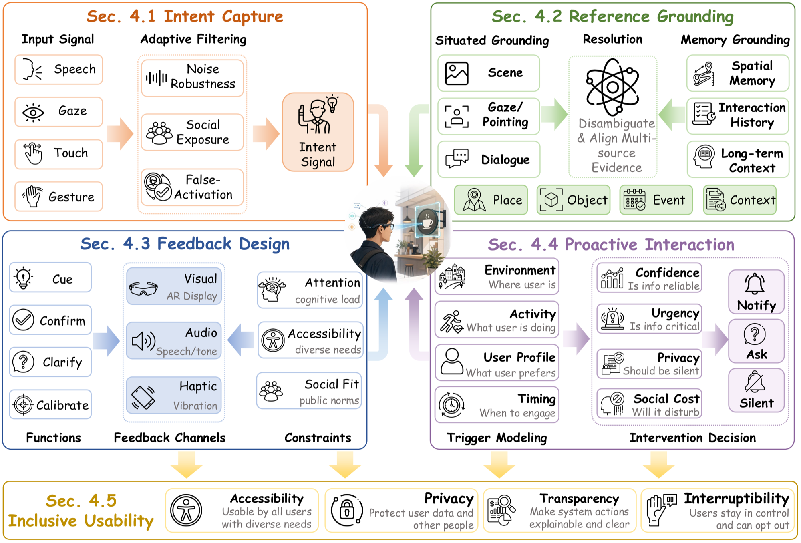
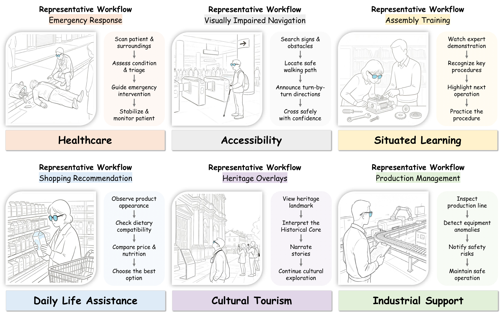

# Awesome AI Smart Glasses Papers

A curated reading list for **AI Smart Glasses**, organized according to the taxonomy in our survey paper **AI Smart Glasses for Wearable Intelligence: From Egocentric Sensing to Agentic Personalization**. It collects papers on smart glasses and closely related egocentric wearable devices that support situated sensing, context-aware understanding, multimodal interaction, and real-world assistance.

<div align="center">

[](./AI%20Smart%20Glasses%20for%20Wearable%20Intelligence.pdf) [](https://arxiv.org/abs/2609.19793) [](LICENSE) [](https://github.com/xandery-geek/Awesome-AI-Smart-Glasses-Papers)

🌟 Star this repository if you find it useful.

</div>

<a id="news"></a>

## 🚀 News

- `[2026/09]` Our paper [AI Smart Glasses for Wearable Intelligence: From Egocentric Sensing to Agentic Personalization](https://arxiv.org/abs/2609.19793) is available on arXiv.
<!-- - `[2026/08]` Our paper [A Survey on AI Smart Glasses for Wearable Intelligence](https://www.preprints.org/manuscript/202608.0648) is available on Preprints.org. -->

## 📂 Table of Contents

- [Awesome AI Smart Glasses Papers](#awesome-ai-smart-glasses-papers)
  - [🚀 News](#-news)
  - [📂 Table of Contents](#-table-of-contents)
  - [📣 Introduction](#-introduction)
  - [🕶️ Hardware Foundation](#️-hardware-foundation)
  - [🤖 Wearable Intelligence](#-wearable-intelligence)
    - [Perception Intelligence](#perception-intelligence)
      - [Spatial Perception](#spatial-perception)
      - [Temporal Perception](#temporal-perception)
      - [Conceptual Perception](#conceptual-perception)
      - [Social Perception](#social-perception)
    - [Contextual Intelligence](#contextual-intelligence)
      - [Personalized Context](#personalized-context)
      - [Environmental Context](#environmental-context)
      - [Temporal Context](#temporal-context)
      - [Knowledge Context](#knowledge-context)
    - [Agentic Intelligence](#agentic-intelligence)
      - [Intent Reasoning](#intent-reasoning)
      - [Task Planning](#task-planning)
      - [Action Execution](#action-execution)
  - [🖥️ Interaction Design](#️-interaction-design)
    - [Intent Capture](#intent-capture)
    - [Reference Grounding](#reference-grounding)
    - [Feedback Design](#feedback-design)
    - [Proactive Interaction](#proactive-interaction)
    - [Inclusive Usability](#inclusive-usability)
  - [🎬 Application Scenarios](#-application-scenarios)
    - [Healthcare](#healthcare)
    - [Accessibility](#accessibility)
    - [Situated Learning](#situated-learning)
    - [Daily Life Assistance](#daily-life-assistance)
    - [Cultural Tourism](#cultural-tourism)
    - [Industrial Support](#industrial-support)
  - [🔭 Future Directions](#-future-directions)
  - [💬 Citation](#-citation)
  - [🤝 Contributing](#-contributing)

<a id="introduction"></a>

## 📣 Introduction

<div align="center">

<br>
<em><b>Section figure.</b> Overview of the AI smart glasses survey taxonomy.</em>
</div>

AI smart glasses are emerging as wearable-intelligence platforms that combine egocentric sensing, resource-aware computing, contextual and agentic reasoning, multimodal interaction, and real-world deployment constraints. Unlike handheld assistants, they observe the world from the wearer's perspective and can provide hands-free, situated assistance during daily activity.

Following the survey, this list is organized around four connected layers:

- **Hardware Foundation:** sensing arrays, computing platforms, interaction units, and supporting infrastructure.
- **Wearable Intelligence:** perception, contextual, and agentic intelligence for turning egocentric observations into assistance.
- **Interaction Design:** intent capture, reference grounding, feedback, proactivity, and inclusive usability.
- **Application Scenarios:** healthcare, accessibility, situated learning, daily life assistance, cultural tourism, and industrial support.

<a id="hardware-foundation"></a>

## 🕶️ Hardware Foundation

<div align="center">

<br>
<em><b>Section figure.</b> Evolution of representative smart glasses and smart-eyewear systems.</em>
</div>

<!-- <div align="center">

<br>
<em><b>Section figure.</b> Hardware capability stack for AI smart glasses.</em>
</div> -->

The table below offers a quick comparison of representative AI smart-glasses products across sensing, inference, interaction, battery, and storage capabilities. `-` means the specification is not publicly disclosed; `AR1` refers to Qualcomm Snapdragon AR1 Gen1; `mic` and `spk` denote microphone and speaker.

| Product | Release Time | Camera Resolution | Motion Stabilization | Spatial Awareness | Local Inference | Cloud AI | Audio | Display | Touch Control | Battery | Storage |
| --- | --- | --- | --- | --- | --- | --- | --- | --- | --- | --- | --- |
| [Ray-Ban Meta](https://www.meta.com/ai-glasses/ray-ban-meta) | 2023.09 | 12 MP | Yes | - | Snapdragon AR1 | Meta AI | 5-mic, 2-spk | No | Yes | 160 mAh | 32 GB |
| [Rokid AI Glasses](https://glasses.rokid.com/) | 2024.11 | 12 MP | Yes | - | Snapdragon AR1 | Multi-LLM | 4-mic, 2-spk | Binocular | Yes | 210 mAh | 32 GB |
| [INMO Air3](https://www.inmoxr.com/pages/inmo-air3) | 2024.11 | 16 MP | Yes | Yes | Space Computing Chip | GLM AI | 4-mic, 2-spk | Binocular | Yes | 660 mAh | 128 GB |
| [RayNeo X3 Pro](https://rayneo.cn/x3pro.html) | 2025.05 | 12 MP | Yes | Yes | Snapdragon AR1 | Qwen | 3-mic, 4-spk | Binocular | Yes | 245 mAh | 32 GB |
| [Xiaomi AI Glasses](https://www.mi.com/prod/xiaomi-ai-glasses) | 2025.06 | 12 MP | Yes | - | AR1 + BES2700 | MiMo | 5-mic, 2-spk | No | Yes | 263 mAh | 32 GB |
| [Meta Ray-Ban Display](https://www.ray-ban.com/usa/l/discover-meta-ray-ban-display) | 2025.09 | 12 MP | Yes | - | Snapdragon AR1 | Meta AI | 6-mic, 2-spk | Monocular | Yes | 248 mAh | 32 GB |
| [INMO GO3](https://inmolens.com/go3) | 2025.11 | 8 MP | Yes | - | Unisoc W337 | GLM AI | 4-mic, 2-spk | Binocular | Yes | 270 mAh | 64 GB |
| [Qwen G1](https://www.mwcbarcelona.com/exhibitors/36083-qwen-glasses/products/4898-qwen-glasses-g1) | 2026.03 | 12 MP | Yes | - | AR1 + BES2800 | Qwen | 6-mic, 2-spk | No | Yes | 272 mAh | 64 GB |
| [Huawei AI Glasses](https://consumer.huawei.com/cn/audio/ai-glasses) | 2026.04 | 12 MP | Yes | - | Self-developed Chip | PanguLM | 3-mic, 2-spk | No | Yes | 252 mAh | 64 GB |
| [RayNeo V4](https://rayneo.cn/v4.html) | 2026.05 | 9 MP | Yes | - | AR1 + BES2800BP | Qwen | 4-mic, 2-spk | No | Yes | 250 mAh | 64 GB |
| Snap SPECS | 2026.06 | - | Yes | Yes | Dual Snapdragon Chips | - | 6-mic, 2-spk | Binocular | Yes | - | - |
| VITURE Helix | 2026.06 | 12 MP | - | - | - | NVIDIA XR AI | 4-mic, 2-spk | No | Yes | - | - |


<!-- - `[IMWUT 2021]` MemX: An Attention-Aware Smart Eyewear System for Personalized Moment Auto-Capture. `System`
- `[IMWUT 2025]` ActiveEye: Enabling Continuous and Responsive Video Understanding for Smart Eyewear Systems. `System`
- `[IMWUT 2024]` Helios: An Extremely Low Power Event-Based Gesture Recognition for Always-On Smart Eyewear. `System`
- `[SenSys 2025]` mmET: mmWave Radar-Based Eye Tracking on Smart Glasses. `Sensing`
- `[CHI 2023]` EchoSpeech: Continuous Silent Speech Recognition on Minimally-Obtrusive Eyewear Powered by Acoustic Sensing. `Sensing`
- `[MobiCom 2024]` GazeTrak: Exploring Acoustic-Based Eye Tracking on a Glass Frame. `Sensing`
- `[IMWUT 2024]` EyeGesener: Eye Gesture Listener for Smart Glasses Interaction Using Acoustic Sensing. `Sensing`
- `[CHI 2025]` FingerGlass: Enhancing Smart Glasses Interaction via Fingerprint Sensing. `Interaction` -->

## 🤖 Wearable Intelligence

### Perception Intelligence

<div align="center">

<br>
<em><b>Section figure.</b> Perception intelligence for egocentric understanding in AI smart glasses.</em>
</div>

#### Spatial Perception

- `[ICCV 2021]` Egocentric Pose Estimation from Human Vision Span. `Pose`
- `[CVPR 2023]` Ego-Body Pose Estimation via Ego-Head Pose Estimation. `Pose`
- `[TOG 2023]` EgoLocate: Real-Time Motion Capture, Localization, and Mapping with Sparse Body-Mounted Sensors. `Motion Capture`
- `[3DV 2025]` HMD2: Environment-Aware Motion Generation from Single Egocentric Head-Mounted Device. `Motion`
- `[AAAI 2025]` EMHI: A Multimodal Egocentric Human Motion Dataset with HMD and Body-Worn IMUs. `Dataset`
- `[CVPR 2024]` Ego-Exo4D: Understanding Skilled Human Activity from First- and Third-Person Perspectives. `Dataset`
- `[ECCV 2024]` Nymeria: A Massive Collection of Multimodal Egocentric Daily Motion in the Wild. `Dataset`
- `[CVPR 2024]` Real-Time Simulated Avatar from Head-Mounted Sensors. `Avatar`
- `[CVPR 2025]` Ego4o: Egocentric Human Motion Capture and Understanding from Multi-Modal Input. `Motion`
- `[CVPR 2023]` Where Is My Wallet? Modeling Object Proposal Sets for Egocentric Visual Query Localization. `Object Localization`
- `[ICCV 2025]` PRVQL: Progressive Knowledge-Guided Refinement for Robust Egocentric Visual Query Localization. `Object Localization`
- `[CVPR 2025]` RELOCATE: A Simple Training-Free Baseline for Visual Query Localization Using Region-Based Representations. `Object Localization`
- `[AAAI 2026]` EAGLE: Episodic Appearance- and Geometry-Aware Memory for Unified 2D-3D Visual Query Localization in Egocentric Vision. `Object Localization`
- `[CVPR 2023]` R2Former: Unified Retrieval and Reranking Transformer for Place Recognition. `Place Localization`
- `[ICCV 2025]` Efficient Visual Place Recognition Through Multimodal Semantic Knowledge Integration. `Place Localization`

#### Temporal Perception

- `[IJCV 2023]` Visual Object Tracking in First Person Vision. `Tracking`
- `[NeurIPS 2023]` EgoTracks: A Long-Term Egocentric Visual Object Tracking Dataset. `Dataset` `Tracking`
- `[CVPR 2024]` Instance Tracking in 3D Scenes from Egocentric Videos. `Tracking`
- `[arXiv 2024]` EgoNav: Egocentric Scene-Aware Human Trajectory Prediction. `Trajectory Prediction`
- `[TVCG 2024]` HOIMotion: Forecasting Human Motion During Human-Object Interactions Using Egocentric 3D Object Bounding Boxes. `Forecasting`
- `[arXiv 2025]` EgoTraj-Bench: Towards Robust Trajectory Prediction Under Ego-View Noisy Observations. `Benchmark`
- `[CVPR 2022]` Egocentric Prediction of Action Target in 3D. `Forecasting`
- `[ICCV 2023]` Uncertainty-Aware State Space Transformer for Egocentric 3D Hand Trajectory Forecasting. `Forecasting`
- `[TPAMI 2025]` MADiff: Motion-Aware Mamba Diffusion Models for Hand Trajectory Prediction on Egocentric Videos. `Forecasting`

#### Conceptual Perception

- `[CVPR 2022]` Ego4D: Around the World in 3,000 Hours of Egocentric Video. `Dataset`
- `[NeurIPS 2022]` Egocentric Video-Language Pretraining. `Video-Language`
- `[ICCV 2023]` EgoVLPv2: Egocentric Video-Language Pre-Training with Fusion in the Backbone. `Video-Language`
- `[IJCV 2022]` Rescaling Egocentric Vision: Collection, Pipeline and Challenges for EPIC-KITCHENS-100. `Dataset`
- `[CVPR 2022]` Assembly101: A Large-Scale Multi-View Video Dataset for Understanding Procedural Activities. `Dataset`
- `[TNNLS 2023]` ActionCLIP: Adapting Language-Image Pretrained Models for Video Action Recognition. `Action Understanding`
- `[NeurIPS 2023]` Opening the Vocabulary of Egocentric Actions. `Open-Vocabulary`
- `[ICLR 2024]` AntGPT: Can Large Language Models Help Long-Term Action Anticipation from Videos? `Action Anticipation`
- `[CVPR 2025]` VLog: Video-Language Models by Generative Retrieval of Narration Vocabulary. `Video-Language`
- `[arXiv 2026]` EgoDTM: Towards 3D-Aware Egocentric Video-Language Pretraining. `Video-Language`

#### Social Perception

- `[TIP 2020]` Mutual Context Network for Jointly Estimating Egocentric Gaze and Action. `Gaze`
- `[ICCV 2025]` Multi-View Gaze Target Estimation. `Gaze`
- `[IMWUT 2025]` Ambient Light Robust Eye-Tracking for Smart Glasses Using Laser Feedback Interferometry Sensors with Elongated Laser Beams. `Eye Tracking`
- `[CVPR 2022]` Egocentric Deep Multi-Channel Audio-Visual Active Speaker Localization. `Speaker Localization`
- `[CVPR 2023]` Egocentric Auditory Attention Localization in Conversations. `Attention`
- `[CVPR 2024]` The Audio-Visual Conversational Graph: From an Egocentric-Exocentric Perspective. `Conversation`
- `[CVPR 2024]` Modeling Multimodal Social Interactions: New Challenges and Baselines with Densely Aligned Representations. `Social Interaction`
- `[CVPR 2025]` SocialGesture: Delving into Multi-Person Gesture Understanding. `Social Interaction`
- `[CVPR 2026]` Multi-Speaker Attention Alignment for Multimodal Social Interaction. `Social Interaction`

### Contextual Intelligence

<div align="center">

<br>
<em><b>Section figure.</b> Contextual intelligence for personalized and situated wearable assistance.</em>
</div>

#### Personalized Context

- `[NeurIPS 2024]` Yo'LLaVA: Your Personalized Language and Vision Assistant. `Personalization`
- `[ECCV 2024]` AMEGO: Active Memory from Long Egocentric Videos. `Memory`
- `[CVPR 2025]` EgoLife: Towards Egocentric Life Assistant. `Memory` `QA`
- `[arXiv 2026]` EgoSelf: From Memory to Personalized Egocentric Assistant. `Personalization`
- `[CVPR 2026]` Ego-Grounding for Personalized Question-Answering in Egocentric Videos. `QA`
- `[OpenReview 2026]` Memory-Augmented Personalized Retrieval for Long-Context Egocentric Video. `Retrieval`
- `[arXiv 2026]` Query-Conditioned Graph Retrieval for Contextualized LLM Reasoning in Personalized Wearable Data. `Knowledge Graph`

#### Environmental Context

- `[CVPR 2020]` Ego-Topo: Environment Affordances from Egocentric Video. `Affordance`
- `[NeurIPS 2023]` EgoEnv: Human-Centric Environment Representations from Egocentric Video. `Environment Representation`
- `[CVPR 2024]` Action Scene Graphs for Long-Form Understanding of Egocentric Videos. `Scene Graph`
- `[arXiv 2024]` Grounding 3D Scene Affordance from Egocentric Interactions. `3D Affordance`
- `[ICCV 2025]` Visual Intention Grounding for Egocentric Assistants. `Intent Grounding`
- `[NeurIPS 2026]` ContextAgent: Context-Aware Proactive LLM Agents with Open-World Sensory Perceptions. `Proactive Agent`
- `[CVPR 2026]` LifeEval: A Multimodal Benchmark for Assistive AI in Egocentric Daily Life Tasks. `Benchmark`

#### Temporal Context

- `[arXiv 2024]` Aria Everyday Activities Dataset. `Dataset`
- `[IMWUT 2024]` ActSonic: Recognizing Everyday Activities from Inaudible Acoustic Wave Around the Body. `Activity Recognition`
- `[CVPR 2022]` Episodic Memory Question Answering. `Episodic Memory`
- `[ICML 2023]` SpotEM: Efficient Video Search for Episodic Memory. `Video Search`
- `[ECCV 2024]` AMEGO: Active Memory from Long Egocentric Videos. `Memory`
- `[WACV 2026]` Online Episodic Memory Visual Query Localization with Egocentric Streaming Object Memory. `Online Memory`
- `[arXiv 2026]` EgoMemReason: A Memory-Driven Reasoning Benchmark for Long-Horizon Egocentric Video Understanding. `Benchmark`

#### Knowledge Context

- `[CHI 2024]` GazePointAR: A Context-Aware Multimodal Voice Assistant for Pronoun Disambiguation in Wearable Augmented Reality. `Grounded QA`
- `[arXiv 2025]` QA-Dragon: Query-Aware Dynamic RAG System for Knowledge-Intensive Visual Question Answering. `RAG`
- `[CVPR 2026]` SUPERGLASSES: Benchmarking Vision Language Models as Intelligent Agents for AI Smart Glasses. `Benchmark` `Agent`
- `[arXiv 2025]` CRAG-MM: Multi-Modal Multi-Turn Comprehensive RAG Benchmark. `RAG`
- `[arXiv 2026]` WearVox: An Egocentric Multichannel Voice Assistant Benchmark for Wearables. `Benchmark`
- `[CHI 2025]` AiGet: Transforming Everyday Moments into Hidden Knowledge Discovery with AI Assistance on Smart Glasses. `System`
- `[WWW 2026]` Egocentric Co-Pilot: Web-Native Smart-Glasses Agents for Assistive Egocentric AI. `Agent`
- `[arXiv 2026]` VisionClaw: Always-On AI Agents Through Smart Glasses. `Agent`
- `[IMWUT 2021]` MemX: An Attention-Aware Smart Eyewear System for Personalized Moment Auto-Capture. `Memory`
- `[VR 2026]` SpeechLess: Micro-Utterance with Personalized Spatial Memory-Aware Assistant in Everyday Augmented Reality. `Memory`
- `[arXiv 2025]` AI for Service: Proactive Assistance with AI Glasses. `Service Agent`

### Agentic Intelligence

<div align="center">

<br>
<em><b>Section figure.</b> Agentic intelligence for intent reasoning, task planning, and action execution.</em>
</div>

#### Intent Reasoning

- `[CHI 2024]` GazePointAR: A Context-Aware Multimodal Voice Assistant for Pronoun Disambiguation in Wearable Augmented Reality. `Reference Grounding`
- `[IUI 2026]` Gazeify Then Voiceify: Physical Object Referencing Through Gaze and Voice Interaction with Displayless Smart Glasses. `Reference Grounding`
- `[CHI 2025]` Persistent Assistant: Seamless Everyday AI Interactions via Intent Grounding and Multimodal Feedback. `Intent Grounding`
- `[NeurIPS 2026]` ContextAgent: Context-Aware Proactive LLM Agents with Open-World Sensory Perceptions. `Assistance-Need Inference`
- `[NeurIPS 2026]` WAGIBench: Benchmarking Egocentric Multimodal Goal Inference for Assistive Wearable Agents. `Benchmark`
- `[arXiv 2025]` AI for Service: Proactive Assistance with AI Glasses. `Intervention Reasoning`
- `[arXiv 2026]` Intention-Aware Semantic Agent Communications for AI Glasses. `Communication`

#### Task Planning

- `[ICML Workshop 2024]` EPD: Long-term Memory Extraction, Context-aware Planning and Multi-iteration Decision @ EgoPlan Challenge ICML 2024. `Working State`
- `[ICCV 2023]` Context-Aware Planning and Environment-Aware Memory for Instruction Following Embodied Agents. `Working State`
- `[arXiv 2026]` MEMORA: Embodied Action Memory from Egocentric Videos for Reasoning and Planning. `Memory` `Planning`
- `[ICCV 2023]` Pretrained Language Models as Visual Planners for Human Assistance. `Visual Planning`
- `[WACV 2024]` Leveraging Next-Active Objects for Context-Aware Anticipation in Egocentric Videos. `Action Anticipation`
- `[IJCV 2026]` EgoPlan-Bench: Benchmarking Multimodal Large Language Models for Human-Level Planning. `Benchmark`
- `[IJCV 2026]` EgoPlan-Bench2: A Benchmark for Multimodal Large Language Model Planning in Real-World Scenarios. `Benchmark`
- `[CVPR 2026]` LifeEval: A Multimodal Benchmark for Assistive AI in Egocentric Daily Life Tasks. `Benchmark`
- `[CVPR 2026]` SUPERGLASSES: Benchmarking Vision Language Models as Intelligent Agents for AI Smart Glasses. `Benchmark`
- `[WWW 2026]` Egocentric Co-Pilot: Web-Native Smart-Glasses Agents for Assistive Egocentric AI. `Agent`
- `[IMWUT 2025]` Vinci: A Real-Time Smart Assistant Based on Egocentric Vision-Language Model for Portable Devices. `System`

#### Action Execution

- `[NeurIPS 2026]` WearVQA: A Visual Question Answering Benchmark for Wearables in Egocentric Authentic Real-World Scenarios. `Benchmark`
- `[arXiv 2026]` WearVox: An Egocentric Multichannel Voice Assistant Benchmark for Wearables. `Benchmark`
- `[Findings of ACL 2025]` Grounding Task Assistance with Multimodal Cues from a Single Demonstration. `Task Assistance`
- `[CVPR 2026]` Ego2Web: A Web Agent Benchmark Grounded in Egocentric Videos. `Benchmark`
- `[WWW 2026]` Egocentric Co-Pilot: Web-Native Smart-Glasses Agents for Assistive Egocentric AI. `Agent`
- `[arXiv 2026]` VisionClaw: Always-On AI Agents Through Smart Glasses. `Agent`
- `[CVPR 2026]` SUPERGLASSES: Benchmarking Vision Language Models as Intelligent Agents for AI Smart Glasses. `Agent`
- `[CHI 2025]` Satori: Towards Proactive AR Assistant with Belief-Desire-Intention User Modeling. `Situated Guidance`
- `[CHI 2026]` Seeing Eye to Eye: Enabling Cognitive Alignment Through Shared First-Person Perspective in Human-AI Collaboration. `Situated Feedback`

## 🖥️ Interaction Design

<div align="center">

<br>
<em><b>Section figure.</b> Interaction design loop for AI smart glasses.</em>
</div>

### Intent Capture

- `[arXiv 2026]` WearVox: An Egocentric Multichannel Voice Assistant Benchmark for Wearables. `Speech`
- `[CHI 2023]` EchoSpeech: Continuous Silent Speech Recognition on Minimally-Obtrusive Eyewear Powered by Acoustic Sensing. `Silent Speech`
- `[MobiCom 2024]` GazeTrak: Exploring Acoustic-Based Eye Tracking on a Glass Frame. `Gaze`
- `[IMWUT 2024]` EyeGesener: Eye Gesture Listener for Smart Glasses Interaction Using Acoustic Sensing. `Eye Gesture`
- `[CHI 2025]` FingerGlass: Enhancing Smart Glasses Interaction via Fingerprint Sensing. `Touch`
- `[ECCV 2024]` Helios: An Extremely Low Power Event-Based Gesture Recognition for Always-On Smart Eyewear. `Gesture`
- `[IMWUT 2023]` GlassMessaging: Towards Ubiquitous Messaging Using OHMDs. `Messaging`

### Reference Grounding

- `[CHI 2024]` GazePointAR: A Context-Aware Multimodal Voice Assistant for Pronoun Disambiguation in Wearable Augmented Reality. `Situated Grounding`
- `[IUI 2026]` Gazeify Then Voiceify: Physical Object Referencing Through Gaze and Voice Interaction with Displayless Smart Glasses. `Situated Grounding`
- `[VR 2026]` SpeechLess: Micro-Utterance with Personalized Spatial Memory-Aware Assistant in Everyday Augmented Reality. `Memory Grounding`
- `[CHI 2025]` Persistent Assistant: Seamless Everyday AI Interactions via Intent Grounding and Multimodal Feedback. `Grounding`

### Feedback Design

- `[CHI 2020]` The Effectiveness of Visual and Audio Wayfinding Guidance on Smartglasses for People with Low Vision. `Feedback`
- `[IMWUT 2023]` GlassMessaging: Towards Ubiquitous Messaging Using OHMDs. `Feedback`
- `[CHI 2025]` Persistent Assistant: Seamless Everyday AI Interactions via Intent Grounding and Multimodal Feedback. `Repair`
- `[IUI 2026]` Gazeify Then Voiceify: Physical Object Referencing Through Gaze and Voice Interaction with Displayless Smart Glasses. `Confirmation`

### Proactive Interaction

- `[CHI 2025]` AiGet: Transforming Everyday Moments into Hidden Knowledge Discovery with AI Assistance on Smart Glasses. `Trigger Modeling`
- `[VR 2026]` SpeechLess: Micro-Utterance with Personalized Spatial Memory-Aware Assistant in Everyday Augmented Reality. `Contextual Trigger`
- `[arXiv 2025]` AI for Service: Proactive Assistance with AI Glasses. `Intervention`
- `[CHI 2025]` Persistent Assistant: Seamless Everyday AI Interactions via Intent Grounding and Multimodal Feedback. `Intervention`

### Inclusive Usability

- `[CHI 2020]` The Effectiveness of Visual and Audio Wayfinding Guidance on Smartglasses for People with Low Vision. `Accessibility`
- `[Applied Sciences 2026]` Interaction Design Strategies of AI Smart Glasses for Older Workers: An Embodied Cognition Perspective and Usability Evaluation. `Older Workers`
- `[CHI EA 2025]` Through the Lens of Privacy: Exploring Privacy Protection in Vision-Language Model Interactions on Smart Glasses. `Privacy`

## 🎬 Application Scenarios

<div align="center">

<br>
<em><b>Section figure.</b> Application scenarios for AI smart glasses.</em>
</div>

### Healthcare

- `[NPJ Digital Medicine 2025]` A Systematic Literature Review on Integrating AI-Powered Smart Glasses into Digital Health Management for Proactive Healthcare Solutions. `Survey`
- `[arXiv 2025]` A Smart-Glasses for Emergency Medical Services via Multimodal Multitask Learning. `Emergency Care`
- `[Nurse Education in Practice 2023]` The Use of Smart Glasses in Nursing Education: A Scoping Review. `Nursing Education`
- `[JMIR Formative Research 2025]` Social Acceptance of Smart Glasses in Health Care: Model Evaluation Study of Anticipated Adoption and Social Interaction. `Acceptance`
- `[JAMDA 2025]` Smart Glasses for Older Adults With Cognitive Impairment: A Scoping Review. `Older Adults`
- `[JMIR Aging 2026]` AI-Enabled Smart Glasses for Active Aging: Scoping Review. `Active Aging`

### Accessibility

- `[CHI 2020]` The Effectiveness of Visual and Audio Wayfinding Guidance on Smartglasses for People with Low Vision. `Low Vision`
- `[SEC 2025]` Exploring LLM-Based Assistants with Smart Glasses for the Visually Impaired. `Visual Impairment`
- `[Scientific Reports 2025]` Making Smartglasses Accessible: Perspectives and Prototypes from Co-Design with People with Aphasia. `Aphasia`
- `[DIS 2026]` Reshaping Inclusive Interpersonal Dynamics Through Smart Glasses in Mixed-Vision Social Activities. `Blind and Low Vision`

### Situated Learning

- `[JIII 2020]` Augmented Reality Smart Glasses in Industrial Assembly: Current Status and Future Challenges. `Industrial Learning`
- `[Machines 2020]` MARMA: A Mobile Augmented Reality Maintenance Assistant for Fast-Track Repair Procedures in the Context of Industry 4.0. `Maintenance`
- `[Virtual Reality 2020]` Evaluating the Effectiveness of Learning Design with Mixed Reality in Higher Education. `Education`
- `[Smart Learning Environments 2023]` A Critical Evaluation, Challenges, and Future Perspectives of Using AI and Emerging Technologies in Smart Classrooms. `Smart Classroom`

### Daily Life Assistance

- `[CHI 2025]` AiGet: Transforming Everyday Moments into Hidden Knowledge Discovery with AI Assistance on Smart Glasses. `Daily Assistance`
- `[CVPR 2025]` EgoLife: Towards Egocentric Life Assistant. `Life Assistant`
- `[CVPR 2026]` SUPERGLASSES: Benchmarking Vision Language Models as Intelligent Agents for AI Smart Glasses. `Visual QA`
- `[arXiv 2026]` VisionClaw: Always-On AI Agents Through Smart Glasses. `Daily Agent`
- `[WWW 2026]` Egocentric Co-Pilot: Web-Native Smart-Glasses Agents for Assistive Egocentric AI. `Web Agent`
- `[IMWUT 2025]` Vinci: A Real-Time Smart Assistant Based on Egocentric Vision-Language Model for Portable Devices. `Portable Assistant`

### Cultural Tourism

- `[JHTT 2016]` Mapping Requirements for the Wearable Smart Glasses Augmented Reality Museum Application. `Museum`
- `[Leisure Studies 2019]` Augmented Reality Smart Glasses Visitor Adoption in Cultural Tourism. `Adoption`
- `[JTEC 2018]` TouristicAR: A Smart Glass Augmented Reality Application for UNESCO World Heritage Sites in Malaysia. `Heritage`
- `[Personal and Ubiquitous Computing 2020]` Enhancing Cultural Heritage Outdoor Experience with Augmented-Reality Smart Glasses. `Heritage`

### Industrial Support

- `[IJERPH 2020]` Smart Glasses-Based Personnel Proximity Warning System for Improving Pedestrian Safety in Construction and Mining Sites. `Safety`
- `[JMSE 2024]` Development of Augmented Reality Technology Implementation in a Shipbuilding Project Realization Process. `Shipbuilding`
- `[Aquacultural Engineering 2023]` Smart Headset, Computer Vision and Machine Learning for Efficient Prawn Farm Management. `Aquaculture`
- `[Animals 2019]` Exploring Smart Glasses for Augmented Reality: A Valuable and Integrative Tool in Precision Livestock Farming. `Livestock`
- `[Applied Sciences 2020]` Performance and Usability of Smartglasses for Augmented Reality in Precision Livestock Farming Operations. `Livestock`

<a id="future-directions"></a>

## 🔭 Future Directions

The survey highlights five cross-cutting directions for future AI smart glasses:

- **Next-generation hardware:** lightweight displays, efficient processors, larger local memory, longer battery life, thermal management, and practical all-day form factors.
- **Trustworthy egocentric intelligence:** fairness, explainability, robustness, safety, and privacy preservation for users and bystanders.
- **Lifelong personalized memory:** controllable mechanisms for storing, updating, retrieving, forgetting, and compressing user-specific experience.
- **Proactive intelligence:** timely assistance that balances inferred user needs with interruption cost, social context, and user control.
- **Embodied foundation models:** efficient models that reason over egocentric perception, temporal dynamics, affordances, intent, and real-world task progress.

## 💬 Citation

If you find this survey and repository useful for your research, please consider citing:

```bibtex
@article{yuan2026ai,
  title={AI Smart Glasses for Wearable Intelligence: From Egocentric Sensing to Agentic Personalization},
  author={Yuan, Xu and Wang, Yi and Jiang, Zhuohang and Qu, Haohao and Ding, Yujuan and Lin, Shanru and Xing, Guoliang and Yang, Hongxia and Cao, Jiannong and Li, Qing and others},
  journal={arXiv preprint arXiv:2609.19793},
  year={2026}
}
```

## 🤝 Contributing

Contributions are welcome. Please add papers that are directly related to AI smart glasses, smart eyewear, wearable augmented reality, egocentric wearable sensing, or assistive egocentric agents.

Suggested format:

```markdown
- `[Venue Year]` Paper Title. `Tag`
```

Please avoid adding general-purpose AI/LLM/RAG/agent/recommendation papers unless the work is explicitly grounded in smart glasses, egocentric wearable sensing, or wearable assistance.
